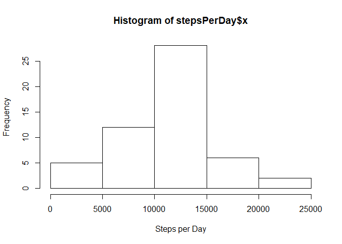
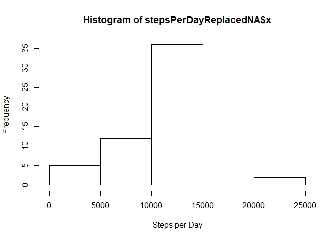
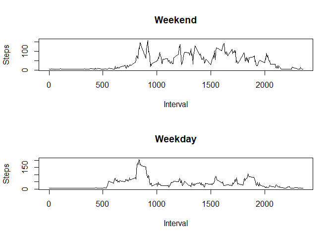

## Loading and preprocessing the data

Process/transform the data (if necessary) into a format suitable for your analysis


```r
activity <- read.csv("activity.csv")
```

## What is mean total number of steps taken per day?

Calculate the total number of steps taken per day and make a histogram of the total number of steps taken each day


```r
stepsPerDay <- aggregate(activity$steps, by=list(activity$date), FUN=sum)
hist(stepsPerDay$x, xlab = "Steps per Day")
```

<!-- -->

Calculate and report the mean and median of the total number of steps taken per day


```r
meanStepsPerDay <- mean(stepsPerDay$x, na.rm=TRUE)
meanStepsPerDay
```

```
## [1] 10766.19
```

```r
medianStepsPerDay <- median(stepsPerDay$x, na.rm=TRUE)
medianStepsPerDay
```

```
## [1] 10765
```

## What is the average daily activity pattern?

Make a time series plot of the 5-minute interval (x-axis) and the average number of steps taken, averaged across all days (y-axis)


```r
stepsByInterval <- aggregate(activity[!is.na(activity$steps),]$steps, by=list(activity[!is.na(activity$steps),]$interval), FUN=mean)

plot(stepsByInterval, type="l", xlab = "Interval", ylab = "Steps")
```

<!-- -->

Which 5-minute interval, on average across all the days in the dataset, contains the maximum number of steps?


```r
stepsByInterval[stepsByInterval$x == max(stepsByInterval$x),]$Group.1
```

```
## [1] 835
```

## Imputing missing values

Calculate and report the total number of missing values in the dataset.


```r
nrow(activity[is.na(activity$steps),])
```

```
## [1] 2304
```

Devise a strategy for filling in all of the missing values in the dataset. The strategy does not need to be sophisticated.
Create a new dataset that is equal to the original dataset but with the missing data filled in.


```r
activityReplacedNA <- activity

meanStepsPerInterval <- mean(aggregate(activity[!is.na(activity$steps),]$steps, by=list(activity[!is.na(activity$steps),]$interval), FUN=mean)$x)

activityReplacedNA[is.na(activityReplacedNA$steps),]$steps <- meanStepsPerInterval
```

Make a histogram of the total number of steps taken each day and Calculate and report the mean and median total number of steps taken per day.


```r
stepsPerDayReplacedNA <- aggregate(activityReplacedNA$steps, by=list(activityReplacedNA$date), FUN=sum)
hist(stepsPerDayReplacedNA$x, xlab="Steps per Day")
```

<!-- -->

```r
meanStepsPerDayReplacedNA <- mean(stepsPerDayReplacedNA$x)
meanStepsPerDayReplacedNA
```

```
## [1] 10766.19
```

```r
medianStepsPerDayReplacedNA <- median(stepsPerDayReplacedNA$x)
medianStepsPerDayReplacedNA
```

```
## [1] 10766.19
```

So we can see that the mean values are the same when the NA values were replaced, but the median values has a small difference.

## Are there differences in activity patterns between weekdays and weekends?

Create a new factor variable in the dataset with two levels - "weekday" and "weekend" indicating whether a given date is a weekday or weekend day.


```r
activityReplacedNA$weekday <- weekdays(as.Date(activityReplacedNA$date))
activityReplacedNA[activityReplacedNA$weekday == "domingo",]$weekday <- "weekend"
activityReplacedNA[activityReplacedNA$weekday == "sábado",]$weekday <- "weekend"
activityReplacedNA[activityReplacedNA$weekday != "weekend",]$weekday <- "weekday"
```

Make a panel plot containing a time series plot of the 5-minute interval (x-axis) and the average number of steps taken, averaged across all weekday days or weekend days (y-axis).


```r
par(mfrow=c(2,1)) 
stepsByIntervalWeekend <- aggregate(activityReplacedNA[activityReplacedNA$weekday == "weekend",]$steps, by=list(activityReplacedNA[activityReplacedNA$weekday == "weekend",]$interval), FUN=mean)

plot(stepsByIntervalWeekend, type="l", ylab = "Steps", xlab = "Interval", main = "Weekend")

stepsByIntervalWeekday <- aggregate(activityReplacedNA[activityReplacedNA$weekday == "weekday",]$steps, by=list(activityReplacedNA[activityReplacedNA$weekday == "weekday",]$interval), FUN=mean)

plot(stepsByIntervalWeekday, type="l", ylab = "Steps", xlab = "Interval", main = "Weekday")
```

<!-- -->


